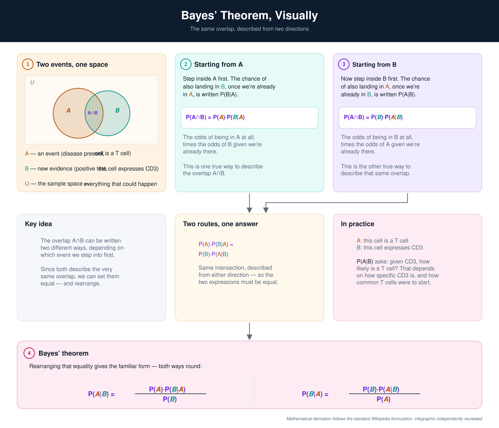

# Bayes-for-Bioinformatics

*Learning Bayesian inference through practical problems in genomics, microbiome, and single-cell biology.*

---

## Why this repo

Bayesian inference shows up everywhere in modern bioinformatics — differential abundance testing in microbiome data, uncertainty quantification in single-cell annotation, hierarchical models for multi-sample genomics — but it's easy to use these tools without really understanding what they're doing underneath.

This repo is my working-through of Bayesian statistics from first principles, applied to the kinds of data I actually work with. It's a learning project, not a finished textbook: some folders are built out, others are placeholders for where I'm headed next.

## Bayes' theorem, briefly

Bayes' theorem describes how to update a belief about something (a hypothesis, a diagnosis, a cell type) when new evidence arrives, by combining that evidence with what was already known beforehand.

$$P(A \mid B) = \frac{P(A) \cdot P(B \mid A)}{P(B)}$$

In a bioinformatics setting, `A` might be "this cell is a T cell" and `B` might be "this cell expresses CD3." The theorem says the probability of `A` given the evidence `B` depends not just on how well the evidence fits, but on how common `A` was to begin with — the prior. Ignoring that prior is one of the most common sources of misleading conclusions in biological data analysis.

## Where this comes up in the field

**Challenges**
-  **Misinterpretation** — without a solid grasp of the theorem, it's easy to misread posterior probabilities and draw faulty conclusions from noisy data.
-  **Overlooking prior knowledge** — ignoring or misspecifying priors can lead to misleading or poorly calibrated conclusions, particularly when data are limited, as is often the case in single-                                       cell and microbiome studies.
-  **Computational complexity** — exact Bayesian inference is often intractable at scale, requiring MCMC or variational methods and the tooling to run them.

**Opportunities**
-  **Better decision-making** — Bayesian reasoning underlies clinical risk prediction, variant classification, and diagnostic modelling.
-  **Better predictive models** — Bayesian hierarchical models let information be shared across samples, genes, or cell types rather than treating each independently.
-  **Honest uncertainty** — a posterior distribution says how confident a result is, not just what the point estimate is, which matters a great deal in clinical and translational settings.

## Tools

| Language | Libraries |
|:---|:---|
| R | `brms`, `bayesrules`, `BayesFactor` |
| Python | `PyMC`, `SciPy`, `ArviZ` |

## Repository structure

```text
Bayes-for-Bioinformatics/
│
├── 01_bayes_foundations/        Bayes' theorem from first principles, worked examples
├── 02_probability_simulation/   Simulating priors, likelihoods, and posteriors
├── 03_conjugate_models/         Beta-Binomial, Normal-Normal, and other closed-form models
├── 04_mcmc_and_pymc/            Sampling methods: Metropolis-Hastings, HMC, NUTS
├── 05_bayesian_regression/      Hierarchical and shrinkage models
├── 06_bayesian_microbiome/      Differential abundance and compositional data
├── 07_bayesian_single_cell/     Uncertainty in cell-type annotation
└── 08_bayesian_genomics/        Genomic uncertainty and hierarchical models
```

Folders further down the list are added as I reach them — a folder without a notebook yet contains a short `README.md` describing what's planned there, rather than being left silent.

## Visual proof

This infographic illustrates a geometric derivation of Bayes' theorem from the relationship between joint and conditional probabilities. The mathematical derivation follows the standard formulation described in the [Wikipedia article on Bayes' theorem](https://en.wikipedia.org/wiki/Bayes%27_theorem), while the infographic itself was recreated and redesigned for educational use in this repository.

<div align="center">
  
</div>

## Status

Actively being built out. Notebooks are added as I work through each topic — this is a learning log, not a polished benchmark.
